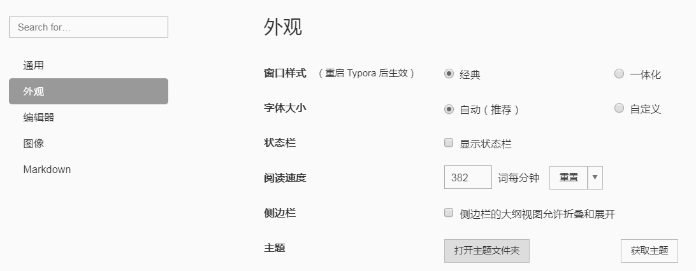

Typora自动添加章节编号
===

原理
---

typora通过自定义CSS可以支持自定义章节编号，官方文档请参考：https://support.typora.io/Auto-Numbering/

操作步骤：
1. 点击`文件/偏好设置...`菜单，选择`外观`标签页面：

2. 点击`打开主题文件夹`，此时会显示typora CSS配置文件所在目录，例如我本机的CSS目录为`C:\Users\Administrator\AppData\Roaming\Typora\themes`；
3. 将`CSS`目录下的`*.css`文件覆盖进去。

配置文件
---

参考`CSS`目录下的`css`文件。

