建立Servlet工程
===

建立工程
---

### 新建Java工程

IDEA 2020版本建立工程时无法选择“Web Application”选项，用户需要建立Java工程后，再修改工程属性。

详细过程如下：


**建立Java工程**：

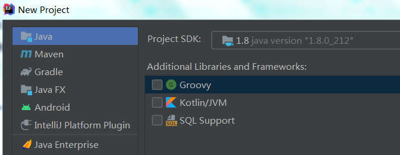

**下一步，不要选择通过模板创建工程**：

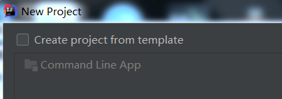

**下一步，设置工程名称`servletDemo`，下一步完成工程创建**：

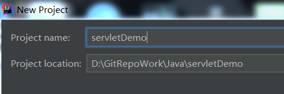


### 设置FrameWork

右键点击工程，选择`Add Framework Support...`：

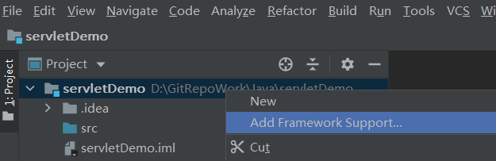

再接下来的对话框中选择`Web Application`：

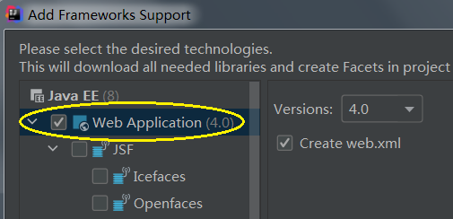

完成后会在工程界面中出现`web`目录，最终的工程视图：

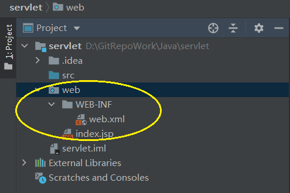


### 增加调试运行配置

点击主界面右上角的`Add Configuration`按钮，设置`Run/Debug Configuration`：

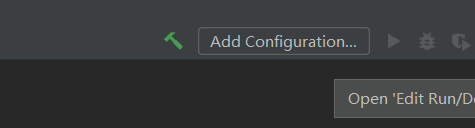


也可以通过菜单`Run/Run...`进入该配置界面：
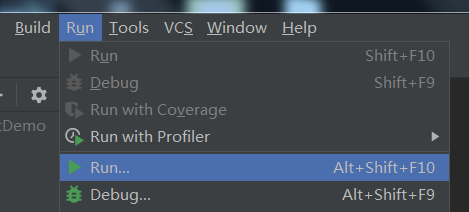


打开对话框后点击左上角的“+”，在弹出的列表中选择“Tomcat/Local”，此步骤用于增加Tomcat配置：

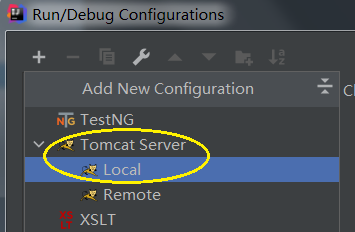


配置Tomcat参数，首次配置时会提示用户输入Tomcat的根路径，这里是已经设置好的界面，两个参数比较重要：

> 1. After lauch：调试或者运行程序后启动哪个浏览器来进行验证；
> 2. URL：浏览器启动后的起始页面，下图中将起始页面设置为本工程的首页；

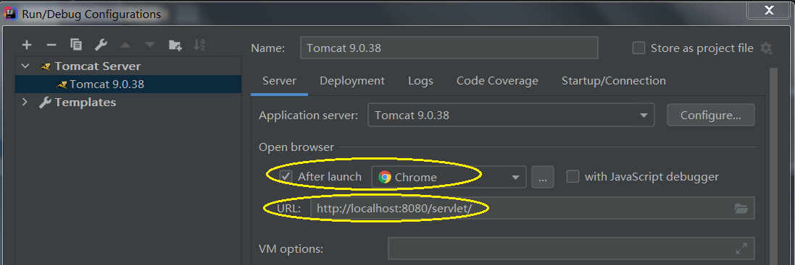


您也可以点击Configuration按钮，设置Tomcat的目录：

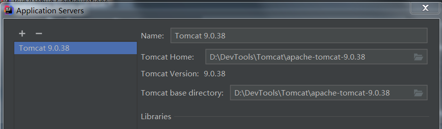


### 设置工程属性`Project Structure`

`Project Structure`菜单位于`File/Project Structure`，在这里可以设置本工程相关的属性信息，例如依赖、输出等。

#### 增加依赖库

依赖库有两个：

1. `servlet-api.jar`，此文件位于tomcat程序的lib目录下；
2. tomcat SDK。


##### 增加servlet-api.jar

点击，选择`Modules`，然后点击Dependencies增加依赖库：

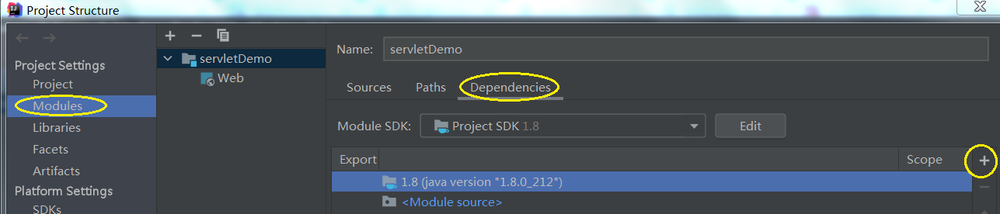


点击“+”按钮，增加Jar依赖包：

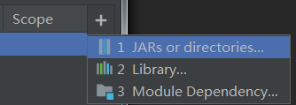


随后选择servlet-api.jar文件：

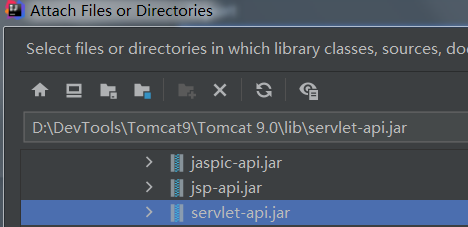

点击OK完成。


##### 增加Tomcat SDK

点击“+”按钮，增加Lib依赖包：


随后选择tomcat包，增加进去：

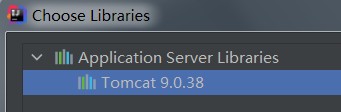


完成后依赖库列表如下：

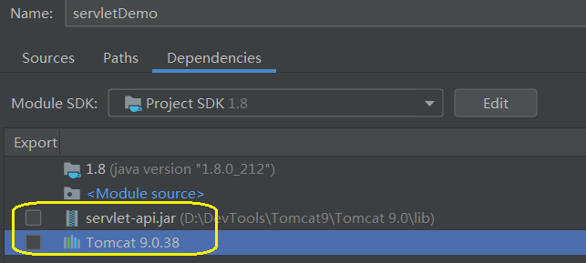


#### 设置`Artifacts`

Artifacts页面用于设置输出编译后的文件，可以是平铺，也可以打包为JAR包/WAR包。

选择`Artifacts`选项进入配置页面：

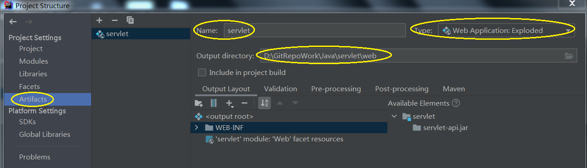

关键参数说明：
> 1. Name：本servlet的工程名，生成war文件时以此名字作为文件名；
> 2. Output Directory：输出路径，这里最好将输出路径修改到`web`目录下，这样输出的东西可以直接给tomcat使用了；
> 3. Type：选择`Web Application Exploded`，输出解压缩后的servlet程序；


### 设置调试/运行部署

此页面的设置将应用部署到Tomcat服务器中运行。

重新进入到`Run/Debug Configuration`界面中，选择`Tomcat Server`，进入到`Deployment`页面下，点击右边的“+”，选择`Artifacts...`：

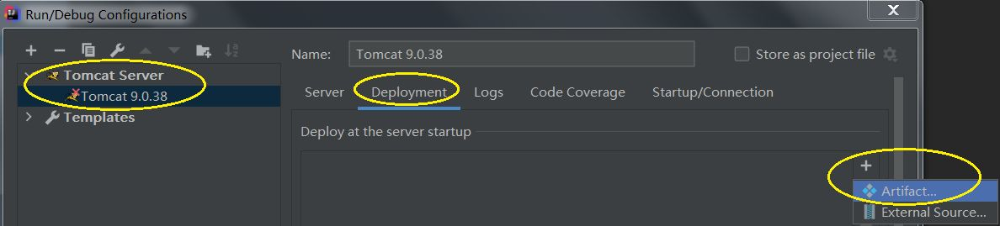


完成后的界面如下，重点说明：

> 1. Deploy at the server startup] 列表中会出现 servlet项，这个就是我们之前配置的artifacts，运行时IEAD会将此Artifacts部署到Tomcat中运行；
> 2. Application  context 设置为与工程同名就可以了，后面通过浏览器访问时会用到：本Project的根目录，例如下图中设置的路径是`http://localhost:8080/servlet`，那么我们后续测试本工程时所有目录都是在此URL上进行追加的，例如对本工程而言，URI `/hello`对应的URL是：`http://localhost:8080/servlet/hello`；

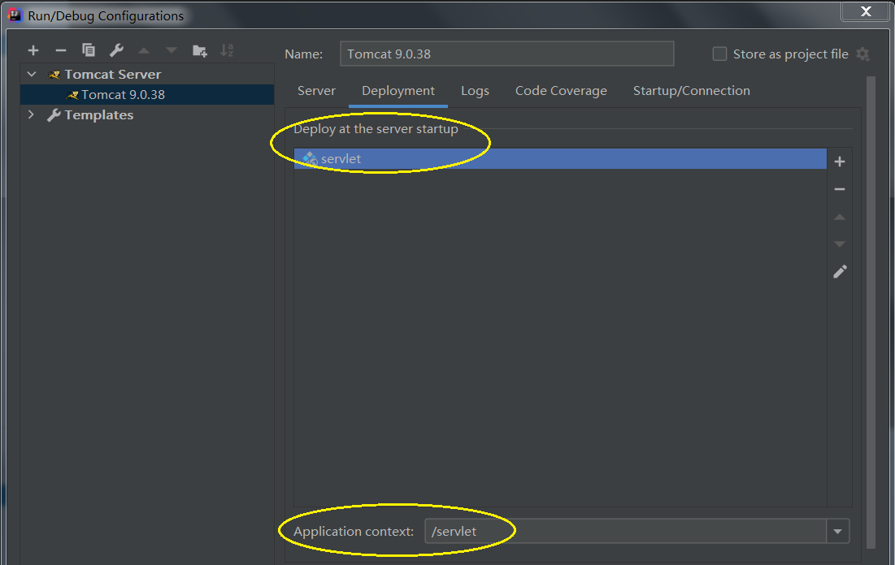


编写应用
---

### 创建Servlet

在工程的`src`目录上点击右键，先创建一个packet：

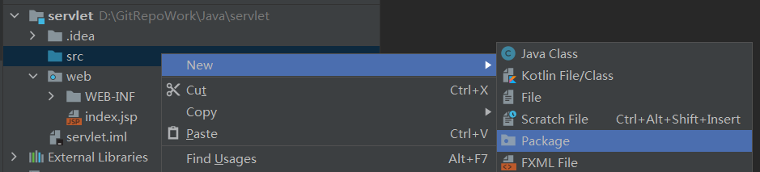


在接下来的对话框中输入`com.test`。
接下来在`com.test`目录上点击右键，选择`New/Create New Servlet`：

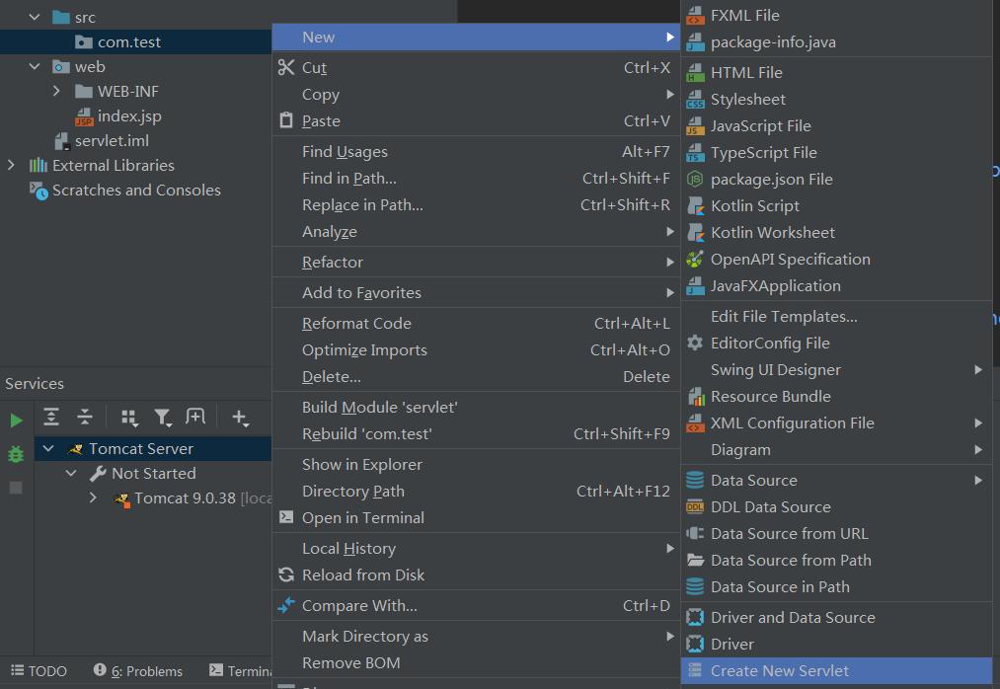


在弹出来的对话框中设置Name为`hello`，包归属到`com.test`：

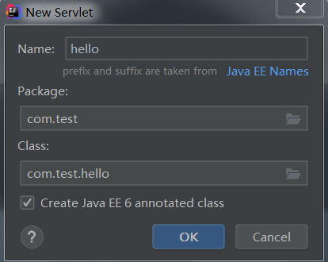


可以看到，工程文件中新增加了`hello.java`，接下来修改代码，在`doGet`函数中输出一些内容：

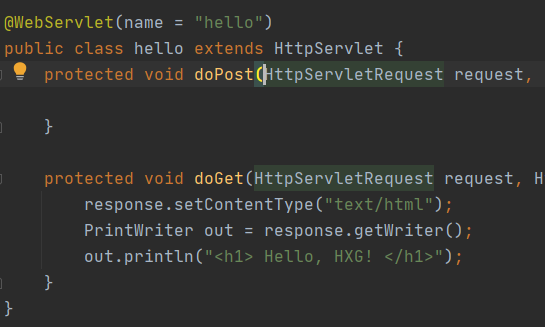


代码如下：
```java
protected void doGet(HttpServletRequest request, HttpServletResponse response) throws ServletException, IOException {
    response.setContentType("text/html");
    PrintWriter out = response.getWriter();
    out.println("<h1> Hello, HXG! </h1>");
}
```


最后设置`web/WEB-INF/web.xml`配置文件：

```xml
<?xml version="1.0" encoding="UTF-8"?>
<web-app xmlns="http://xmlns.jcp.org/xml/ns/javaee"
         xmlns:xsi="http://www.w3.org/2001/XMLSchema-instance"
         xsi:schemaLocation="http://xmlns.jcp.org/xml/ns/javaee http://xmlns.jcp.org/xml/ns/javaee/web-app_4_0.xsd"
         version="4.0">
    <servlet>
        <servlet-name>hello</servlet-name>
        <servlet-class>com.test.hello</servlet-class>
        <load-on-startup>1</load-on-startup>
    </servlet>
    <servlet-mapping>
        <servlet-name>hello</servlet-name>
        <url-pattern>/hello</url-pattern>
    </servlet-mapping>
</web-app>
```


### 测试验证

点击IDE界面中的运行按钮：

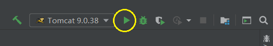


运行后的界面如下：

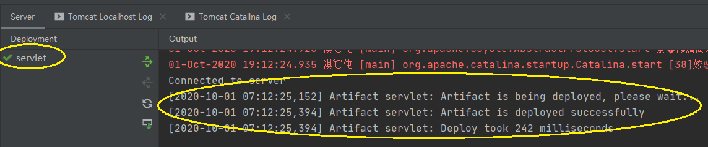


其中：
> 1. Deployment 下面显示了当前已经部署的工程，本次工程为servlet；
> 2. 右边Output窗口中显示了Tomcat的输出，提示部署成功。

最后，打开浏览器。地址栏输入`http://localhost:8080/servlet/hello`，效果如下：


### 重新发布

测试过程中我们可能会改正程序并重新发布，此时我们可以不必重启tomcat服务，过程如下。

首先改写代码：

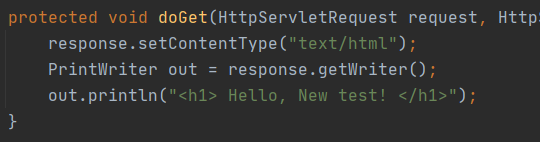


然后点击重新发布按钮：

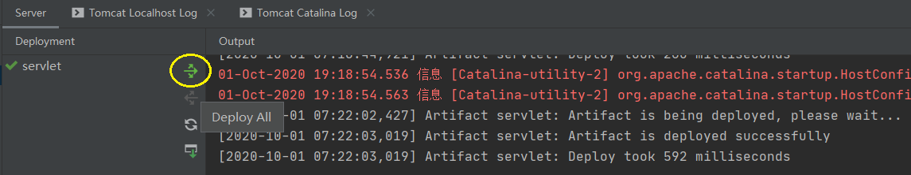


最后打开浏览器，效果如下：


建立Spring MVC工程
===

工程配置
---

### 建立Java工程

同建立Servlet工程

### 增加Framework支持时选择Spring MVC


